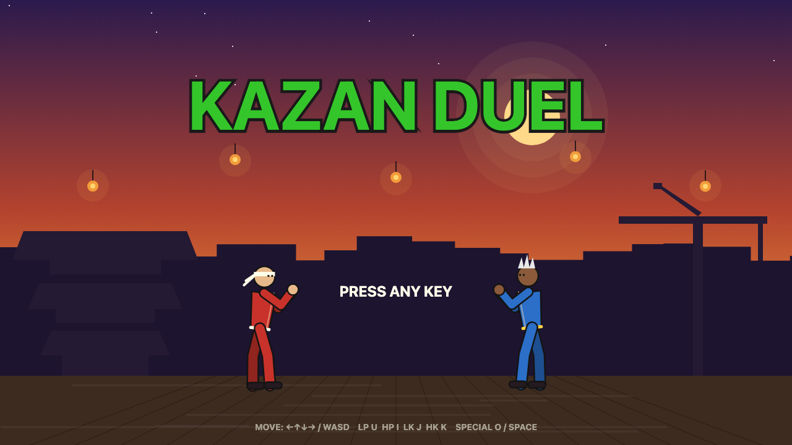
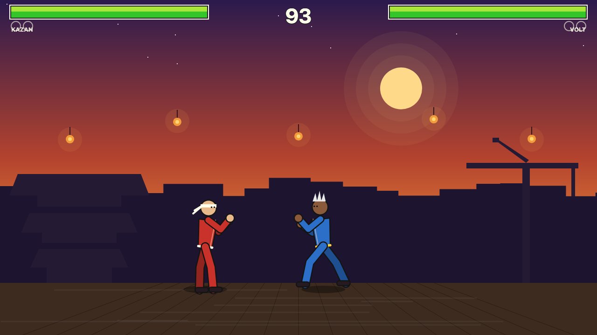
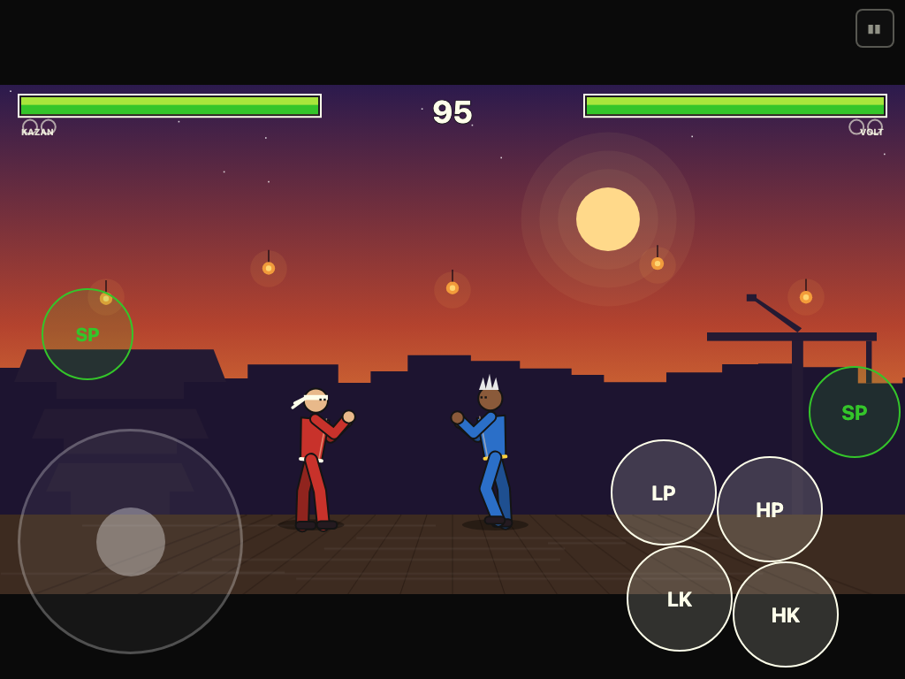

# KAZAN DUEL

A Street Fighter-style 1v1 fighting game against a CPU opponent, built as **one fully self-contained HTML file** — no frameworks, no external assets, no build step. All graphics are procedural canvas vector art and all sound is synthesized WebAudio.

**▶ Play it here: https://upscale-casey.github.io/street-fighter-fable5/**

Works on iPad / iPhone (touch controls) and PC (keyboard) in the same file.



## Features

- **KAZAN vs VOLT** — two fighters sharing an 11-move kit: 6 normals, 2 air attacks, and 3 specials (Ember Wave projectile, invulnerable Sky Splitter uppercut, advancing Cyclone Boot)
- **Three CPU difficulties** — Easy / Medium / Hard. The CPU plays through the same virtual input interface as you (no frame-data cheats): difficulty changes its reaction delay (32/19/11 frames), block/anti-air/punish probabilities, and aggression
- **Real fighting-game systems** — startup/active/recovery frame data, high/low/overhead blocking, chip damage, jab chains and special cancels with damage scaling, knockdowns with wake-up invulnerability, hitstop, pushback with corner logic, projectile clashes
- **Best-of-3 rounds**, 99-second timer, time-over resolution, draws, Perfect wins, and a 2-2 tiebreaker final round
- **60 Hz fixed-timestep logic** with interpolated rendering, letterboxed 16:9 scaling at any window size or device rotation
- Synthesized SFX and a chiptune music loop, pause menu, mute toggle



## Controls

### Keyboard (PC)

| Action | Keys |
|--------|------|
| Move / Jump / Crouch | Arrow keys or WASD |
| Light / Heavy Punch | U / I |
| Light / Heavy Kick | J / K |
| Special | O or Space (direction held selects the special) |
| Pause | Escape |

Hold **away from the opponent** to block (down-back for low attacks).

### Touch (iPad / iPhone)

Floating joystick on the left half; LP/HP/LK/HK attack diamond plus SP buttons on the right. Full multi-touch — move and attack simultaneously.



### Specials

| Move | Input |
|------|-------|
| Ember Wave (projectile) | Special (neutral or holding back) |
| Sky Splitter (rising uppercut) | Down + Special |
| Cyclone Boot (advancing kick) | Forward + Special |

## Run locally

Open `index.html` in any browser. That's it.

## Development

The game was planned, designed, developed, and tested by multi-agent Claude Code workflows (see `DESIGN.md` for the full spec and `TESTING.md` for the test contract).

```bash
npm install                 # installs Playwright (test-only dependency)
node test/smoke.mjs         # quick load check (headless Chromium)
node test/run-tests.mjs     # full suite: 32 checks in Chromium + WebKit (≈ iOS Safari)
node test/probe-ai.mjs      # AI behavior probes: anti-turtle + difficulty ladder
```

The Playwright suite covers keyboard and touch input (including multi-touch on iPad viewports), round/match/rematch flow, pause, resize, time-over, and console-error-free play on every difficulty — in both Chromium and WebKit.
